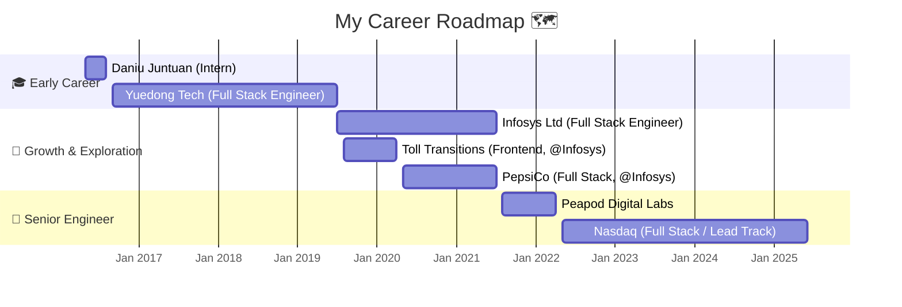

# Hi there 👋

I'm a full-stack software engineer passionate about new technologies and always learning.

## Languages & Frameworks 💻

## My Experience 💼

## My Stats 📊

<!--
**GoldenaArcher/GoldenaArcher** is a ✨ _special_ ✨ repository because its `README.md` (this file) appears on your GitHub profile.

Here are some ideas to get you started:

- 🔭 I’m currently working on ...
- 🌱 I’m currently learning ...
- 👯 I’m looking to collaborate on ...
- 🤔 I’m looking for help with ...
- 💬 Ask me about ...
- 📫 How to reach me: ...
- 😄 Pronouns: ...
- ⚡ Fun fact: ...
-->

<table>
  <tr>
    <td>
      

        
📊 GitHub Stats

        
      

    </td>
    <td>
      

        
🔥 GitHub Streak

        
      

    </td>
  </tr>
  <tr>
    <td>
      

        
🌐 Top Languages

        
      

    </td>
    <td>
      

        
🏆 GitHub Trophies

        
      

    </td>
  </tr>
</table>
